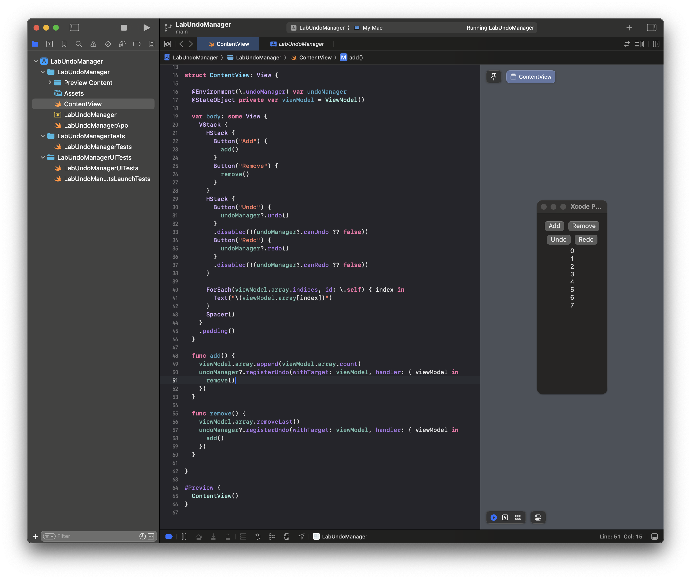

# SwiftUI UndoManager example (undo & redo)



I was struggling with figuring out how "redo" works. The [documentation](https://developer.apple.com/documentation/foundation/undomanager) only mention `registeringUndo()`, but there's no `registerRedo()` !!!. Then I stumble upon this [article](https://nilcoalescing.com/blog/HandlingUndoAndRedoInSwiftUI/). Turns out I need to call another `registeringUndo()` in the handler. 

> "How on earth would I know that it works like that' APPLE !!!???" - All devs around the world

It's also not obvious that it's cleaner to do this by creating 2 opposite operation functions that calls each other in its undo handler. Like this:

```swift
  func add() {
    viewModel.array.append(viewModel.array.count)
    undoManager?.registerUndo(withTarget: viewModel, handler: { viewModel in
      remove()
    })
  }

  func remove() {
    viewModel.array.removeLast()
    undoManager?.registerUndo(withTarget: viewModel, handler: { viewModel in
      add()
    })
  }
```

The prevent humanity from suffering with this same problem, I create an example project to show how it works. This runs on macOS.
